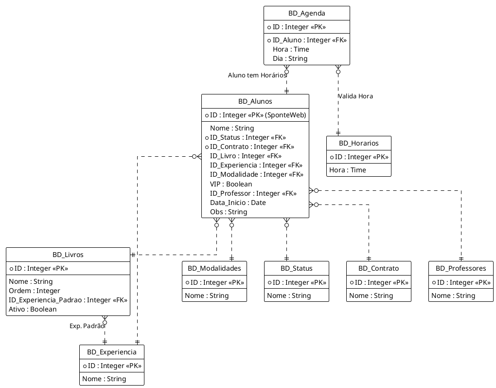

# Wizped Excel Project Analysis

## Overview

The project is an Excel-based application for managing student frequency/attendance sheets ("Fichas de Frequência"). It uses a custom Ribbon UI, VBA UserForms for data entry, and Python for importing external data (Sponte Web PDF reports).

## Architecture

- **Frontend**: Excel Ribbon (XML) + VBA UserForms.
- **Backend/Data**: Excel Sheets acting as relational tables.
- **Integration**: VBA calls Python scripts for complex parsing (PDF import).
- **Automation**: VBA Macros for CRUD operations and Sheet generation.

## Data Schema Analysis

Based on the VBA logic (`VBA_02_FormLogica.bas`), the Excel file functions as a relational database.

### Core Tables

1. **`BD_Alunos`** (Students)

   - Central table.
   - **Relationships**: Links to Status, Contrato, Livro, Experiencia, Modalidade, Professor.
   - **Columns**: ID (Sponte), Nome, StatusID, ContratoID, LivroID, ExperienciaID, ModalidadeID, VIP, ProfessorID, DataInicio, Obs.
2. **`BD_Agenda`** (Schedule)

   - **Type**: One-to-Many with `BD_Alunos`.
   - **Columns**: ID (PK), AlunoID (FK), Hora, Dia.
3. **`BD_Livros`** (Books)

   - **Columns**: ID, Nome, [Unknown], Ordem, ExpPadraoID, Ativo.
   - **Logic**: Used for autocomplete and default experience selection.

### Lookup Tables

These tables provide standard values for dropdowns:

- `BD_Experiencia`: Levels of experience.
- `BD_Modalidades`: Types of classes (e.g., Presencial).
- `BD_Status`: Student status (Ativo, Trancado, etc.).
- `BD_Contrato`: Contract types.
- `BD_Professores`: List of teachers.
- `BD_Horarios`: Valid time slots for the agenda.

## Python Integration

* Current script: `wizped_import.py`
  - Uses `pdfplumber` to extract data from Sponte Web PDFs.
  - Normalization logic for names and IDs.
  - Outputs CSV for VBA to consume.

- **Recommendation**: Move this script to a `src/` directory and use a proper virtual environment (handled by `uv`) to ensure `pdfplumber` is always available.

## Recommendations for Python "Control Center"

Since you want to manipulate the Excel file via Python without online AI:

1. **`xlwings`**: The best choice for interacting with the *active* Excel instance. It allows you to replace VBA logic with Python gradually or drive the Excel UI from Python. It supports writing UDFs (User Defined Functions) in Python.
2. **`pandas`**: Essential for reading the `BD_` sheets as DataFrames, performing complex queries/filtering, and writing back results.
3. **`openpyxl`**: Good for modifying the `.xlsm` file when Excel is *closed* (batch processing).

## Project Organization Plan

To support local Git versioning and a clean structure:

```
wizped/
├── .git/
├── .gitignore          # Ignore temporary Excel files (~$*) and .venv
├── pyproject.toml      # UV dependency definition
├── README.md           # Project documentation
├── src/                # Python source code
│   ├── __init__.py
│   └── wizped_import.py
├── vba/                # Exported VBA modules (for versioning)
│   ├── VBA_01_CriarFormulario.bas
│   ├── VBA_02_FormLogica.bas
│   └── ...
├── ribbon/
│   └── RibbonX_Wizped.xml
├── assets/             # Images/Icons
├── docs/
│   ├── schema.puml     # Database diagram
│   └── analysis.md     # This file
└── gerador_fichas_freq.xlsm (The Tool)
```

## Schema Diagram (PlantUML)

See `docs/schema.puml` for the visual representation.


